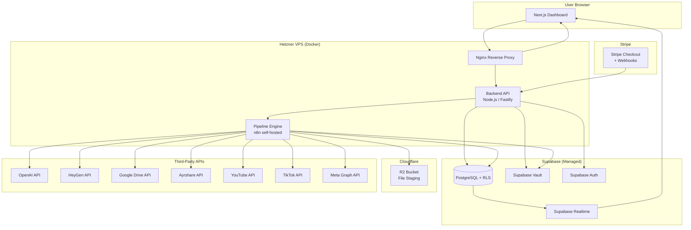
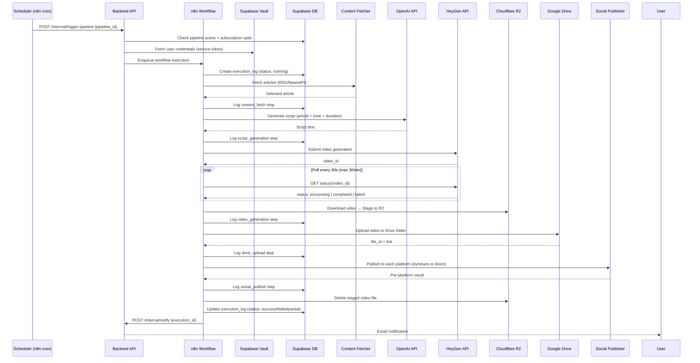

# Design Document: AI Video Automation SaaS

## Overview

The AI Video Automation SaaS is a multi-tenant pipeline platform that automates the entire lifecycle of AI-generated short-form video content: from niche content discovery through script generation, video production, cloud storage, and social media distribution. The platform acts as orchestration glue between third-party services (OpenAI, HeyGen, Google Drive, social media APIs), meaning users supply their own upstream API credentials and pay those vendors directly, while paying the platform a flat subscription for the automation layer.

### Key Design Principles

- **Credential isolation**: User-supplied API keys are encrypted at rest via Supabase Vault and never logged, cached beyond a single request, or transmitted in plaintext.
- **Fault-tolerant pipeline**: Each pipeline step is independently logged; failures in non-critical steps (Drive upload) do not block downstream steps (social publishing).
- **Stateless Backend API**: The Node.js API layer handles auth, orchestration kickoff, and CRUD only. It does not hold long-running state.
- **Async execution engine**: All heavy pipeline work runs inside n8n workflows, decoupled from the HTTP request/response cycle.
- **Multi-tenant row isolation**: Supabase RLS enforces per-user data boundaries at the database layer for every table.

---

## Architecture

### High-Level System Diagram



### Component Responsibilities

| Component | Responsibility |
|---|---|
| **Next.js Dashboard** | User-facing SPA/SSR frontend. Auth UI, pipeline management, execution monitoring, credential settings, onboarding. |
| **Backend API (Fastify)** | Authenticated REST API. Handles auth middleware, CRUD operations, pipeline trigger, credential proxying, Stripe webhook processing. |
| **n8n Pipeline Engine** | Executes the content-fetch → script-generate → video-generate → upload → publish workflow. Manages scheduling via cron triggers. |
| **Supabase (PostgreSQL)** | Primary relational store. Enforces RLS. Stores users, pipelines, execution logs, subscriptions, notification preferences. |
| **Supabase Vault** | AES-256 encrypted secret storage for user API keys and OAuth tokens. Accessed only by Backend API. |
| **Supabase Auth** | Manages email/password and Google OAuth registration, email verification, session JWTs. |
| **Cloudflare R2** | Temporary file staging for generated HeyGen video files during pipeline execution. Cleaned up within 60 minutes. |
| **Stripe** | Subscription billing, webhook delivery for payment events. |
| **Nginx** | Reverse proxy on Hetzner VPS. TLS termination, routing to API and Dashboard. |

### Data Flow: Pipeline Execution



---

## Components and Interfaces

### Backend API (Fastify)

The API runs as a Docker container on Hetzner VPS. It is the sole entry point for Dashboard operations and the webhook receiver.

#### Authentication Middleware

All routes except `/auth/*`, `/webhooks/*`, `/health`, `/privacy`, `/terms`, `/data-deletion`, and `/robots.txt` are protected by JWT middleware. The middleware:

1. Extracts the `Authorization: Bearer <token>` header (or reads from `HttpOnly` session cookie).
2. Validates the JWT signature using the Supabase JWT secret.
3. Confirms token is not expired (24-hour lifetime per Req 1.4).
4. Attaches `req.user = { id, email, subscription_status }` to the request context.
5. Returns `HTTP 401` with `{ error_code: "unauthorized" }` on failure (Req 18.2).

#### CSRF Protection

State-changing routes (POST/PUT/PATCH/DELETE on `/pipelines`, `/credentials`, `/settings`) enforce CSRF token validation:

1. Dashboard fetches CSRF token from `GET /auth/csrf-token` (double-submit cookie pattern).
2. Token is embedded in request headers as `X-CSRF-Token`.
3. Middleware verifies header value matches signed session cookie value.
4. Missing or mismatched tokens return `HTTP 403` with `{ error_code: "csrf_token_invalid" }` (Req 18.6).

#### API Route Map

```
Auth
  POST   /auth/register              Register with email + password
  POST   /auth/login                 Login, returns JWT + sets cookie
  POST   /auth/logout                Clears session cookie
  GET    /auth/verify-email          Email verification callback
  POST   /auth/forgot-password       Send reset link
  POST   /auth/reset-password        Apply new password
  GET    /auth/google                Initiate Google OAuth
  GET    /auth/google/callback       Google OAuth callback
  GET    /auth/csrf-token            Get CSRF token

Subscription
  POST   /subscription/checkout      Create Stripe checkout session
  GET    /subscription/portal        Stripe Customer Portal redirect
  GET    /subscription/status        Current subscription status
  POST   /webhooks/stripe            Stripe webhook receiver

Credentials
  GET    /credentials                List credential types + masked values
  PUT    /credentials/:type          Save/update a credential
  DELETE /credentials/:type          Delete a credential
  GET    /credentials/google/connect Initiate Google Drive OAuth
  GET    /credentials/google/callback Google Drive OAuth callback
  DELETE /credentials/google         Disconnect Google Drive
  GET    /credentials/social/:platform/connect    Initiate social OAuth
  GET    /credentials/social/:platform/callback   Social OAuth callback
  DELETE /credentials/social/:platform            Disconnect social platform

Pipelines
  GET    /pipelines                  List user's pipelines
  POST   /pipelines                  Create a pipeline
  GET    /pipelines/:id              Get pipeline detail
  PUT    /pipelines/:id              Update pipeline
  DELETE /pipelines/:id              Delete pipeline
  POST   /pipelines/:id/enable       Enable pipeline
  POST   /pipelines/:id/disable      Disable pipeline
  POST   /pipelines/:id/trigger      Manual execution trigger

Execution Logs
  GET    /pipelines/:id/executions   Paginated execution history
  GET    /executions/:id             Execution detail

Account / Settings
  GET    /account                    Get account info
  PUT    /account                    Update display name / email
  PUT    /account/password           Change password
  DELETE /account                    Delete account
  GET    /account/notifications      Get notification preferences
  PUT    /account/notifications      Update notification preferences

Internal (service-token protected, not user-facing)
  POST   /internal/trigger-pipeline  n8n → API: fire pipeline
  POST   /internal/notify            n8n → API: send notification
  POST   /internal/pipeline-paused   n8n → API: mark pipeline paused

Public
  GET    /health                     Health check
  GET    /privacy                    Privacy Policy
  GET    /terms                      Terms of Service
  POST   /data-deletion              GDPR / Meta data deletion callback
  GET    /robots.txt                 Robots directives
  GET    /app-ads.txt                App-ads authorized sellers
```

#### Input Sanitization

All user-supplied string inputs (niche keywords, pipeline names, script tones) are sanitized before passing to downstream APIs (Req 18.8):

1. Strip HTML tags and control characters.
2. Check for prompt injection signatures (regex: `ignore previous instructions`, `you are now`, `disregard`, `forget all`, `system prompt`).
3. Reject with `HTTP 400 { error_code: "invalid_input" }` on match.
4. Encode for JSON before passing to OpenAI prompt.

---

### n8n Pipeline Engine

n8n runs as a Docker container on Hetzner VPS with persistent volume mounts for database and credentials. Workflows are version-controlled as JSON exports.

#### Pipeline Workflow Structure

Each Pipeline maps to a single n8n workflow template with parameterized inputs. When a pipeline execution is triggered, the Backend API calls n8n's REST API to start a workflow execution, passing the pipeline configuration and pre-fetched credentials as execution data.

```
Workflow: video-automation-pipeline
├── Trigger: Webhook (called by Backend API)
├── Node 1: Initialize — set execution context, create execution_log row
├── Node 2: Content Fetcher — RSS/NewsAPI query, article selection
├── Node 3: Script Generator — OpenAI Chat Completions call
├── Node 4: Video Generator — HeyGen API call + polling loop
├── Node 5: File Stager — Download video → Upload to R2
├── Node 6: Drive Uploader — Upload from R2 to Google Drive
├── Node 7: Social Publisher — Parallel publish to each platform
├── Node 8: Cleanup — Delete R2 file, finalize execution_log
└── Node 9: Notify — Call Backend API /internal/notify
```

Each node wraps its operation in a try/catch. On error, it writes the failure to the execution_log step record and uses an n8n error branch to jump to the Cleanup + Notify nodes, ensuring the log is always finalized.

#### Credential Flow in n8n

Credentials are **not** stored in n8n's credential store (to avoid duplication of the vault). Instead:

1. Backend API fetches credentials from Supabase Vault using a short-lived service token (max 15-minute lifetime).
2. Credentials are passed as encrypted workflow execution data to n8n via the trigger webhook payload.
3. n8n workflow reads credentials from the execution data context (in-memory only during execution).
4. Credentials are never written to n8n's persistent database or logs.

#### Scheduling

n8n Schedule Trigger nodes are used for cron-based scheduling. When a user creates or updates a pipeline schedule, the Backend API calls n8n's REST API to:

- Create / update / delete the Schedule Trigger node's cron expression for that workflow.
- Each active pipeline has one dedicated n8n workflow instance (or a shared template with per-pipeline schedule triggers).

Cron expressions are computed server-side from the user's configured HH:MM + recurrence in UTC. Schedule updates take effect within 5 seconds via n8n API (Req 12.6).

#### Execution Queue

n8n's built-in queue mode (backed by Redis) is used for execution concurrency control:

- Maximum concurrent executions: 10 (Req 19.6).
- Queue depth limit: 50 pending requests (Req 19.6).
- When queue is full, the trigger webhook returns an error and the Backend API logs "execution queue full" (Req 19.7).

---

### Credential Vault

The Credential Vault is built on [Supabase Vault](https://supabase.com/docs/guides/database/vault), which uses `pgsodium` to store secrets encrypted with a per-secret derived key (AES-256-GCM).

#### Vault Design

- Each credential is stored as one vault secret with a structured name: `{user_id}:{credential_type}` (e.g., `abc123:heygen_api_key`).
- The `vault.secrets` table is not directly accessible to the Dashboard; only the Backend API (using service role key) can read decrypted values.
- The `credentials` table in the public schema stores metadata only (credential type, masked last 4 chars, updated_at, vault_secret_id) — no plaintext values.
- RLS on the `credentials` metadata table ensures each user only sees their own rows.

#### Credential Types

| credential_type | Description |
|---|---|
| `heygen_api_key` | HeyGen API key |
| `openai_api_key` | OpenAI API key (optional — falls back to platform key) |
| `google_drive_refresh_token` | Google OAuth refresh token for Drive |
| `youtube_access_token` | YouTube OAuth access token |
| `youtube_refresh_token` | YouTube OAuth refresh token |
| `tiktok_access_token` | TikTok OAuth access token |
| `tiktok_refresh_token` | TikTok OAuth refresh token |
| `facebook_access_token` | Facebook OAuth access token |
| `instagram_access_token` | Instagram OAuth access token |
| `ayrshare_api_key` | Platform-level Ayrshare key (stored separately, not user-supplied) |

---

### Frontend Dashboard (Next.js)

The Dashboard is a Next.js 14+ application using the App Router, deployed as a Docker container on Hetzner VPS.

#### Page Structure

```
/                        Redirect → /dashboard or /login
/login                   Login form (email/pass + Google OAuth button)
/register                Registration form
/verify-email            Email verification landing
/forgot-password         Password reset request
/reset-password          Password reset form

/dashboard               Pipeline list view (main home)
/dashboard/onboarding    Onboarding checklist (new users)
/pipelines/new           Create pipeline wizard
/pipelines/:id           Pipeline detail + execution history
/pipelines/:id/edit      Edit pipeline form
/executions/:id          Execution detail view

/settings                Settings hub
/settings/credentials    API keys + OAuth connections
/settings/account        Name, email, password
/settings/billing        Subscription status + portal link
/settings/notifications  Notification preferences

/privacy                 Privacy Policy (public)
/terms                   Terms of Service (public)
/demo                    Public demo (no login required) — Req 17.1
```

#### State Management

- **Server Components** (Next.js App Router): Used for initial data fetching (pipeline list, execution detail) to minimize client-side JavaScript.
- **SWR / React Query**: Client-side data fetching and caching for polling-based updates (execution status every 10s — Req 13.5).
- **Zustand**: Lightweight client state for onboarding checklist step tracking and UI state (modals, toasts).
- **Supabase Realtime**: Subscribed to `execution_logs` table changes to push live execution status updates to the Dashboard without polling.

#### Credential Display

After saving any API key, the Dashboard displays only `••••[last4chars]` (Req 3.4). The raw key is never returned by the API after the initial save acknowledgment.

---

### Scheduling Mechanism

#### Cron Expression Computation

User-facing schedule configuration:
- `recurrence`: `daily` | `weekdays` | `custom` (with `days_of_week: [0-6]`)
- `time_of_day`: HH:MM in user's timezone
- `timezone`: IANA timezone string (e.g., `America/New_York`)

Server-side conversion to UTC cron:
1. Parse HH:MM in the user's timezone using `date-fns-tz`.
2. Convert to UTC equivalent HH:MM.
3. Generate cron expression:
   - `daily`: `MM HH * * *`
   - `weekdays`: `MM HH * * 1-5`
   - `custom [1,3,5]`: `MM HH * * 1,3,5`

The computed UTC cron is stored in `pipelines.schedule_cron_utc` and set on the n8n Schedule Trigger.

#### Skipping Already-Running Pipelines

Before starting any pipeline execution, the Backend API checks `execution_logs` for an active execution for that pipeline. If one exists:
- Skip the trigger.
- Insert an `execution_logs` record with `status: skipped`, `failure_reason: "skipped: already running"`.
- This skip is not counted toward the consecutive failure threshold (Req 12.4).

---

### Social Publishing Routing (Ayrshare vs. Direct API)

#### Audit Period Flag

A table `platform_audit_status` stores the current routing mode per social platform:

```
platform_audit_status
  platform: TEXT (youtube | tiktok | facebook | instagram)
  audit_approved: BOOLEAN (default false)
  direct_api_enabled_at: TIMESTAMPTZ
```

The Social Publisher node in n8n queries this table at runtime to determine routing:
- `audit_approved = false` → route through Ayrshare
- `audit_approved = true` → route through direct platform API

#### Ayrshare Routing

During the audit period, the Social_Publisher calls the Ayrshare `/post` endpoint with:
- Platform target list
- Video URL (from R2 or Drive)
- Generated caption
- Platform-specific metadata (visibility, AI label)

Ayrshare post ID is recorded in the execution_log per platform.

#### Direct API Routing

Post-audit, platform-specific handlers are called directly:

| Platform | API | Notes |
|---|---|---|
| YouTube | YouTube Data API v3 `videos.insert` | Resumable upload; visibility per user preference |
| TikTok | TikTok Content Posting API v2 | Privacy `SELF_ONLY` during audit, then user preference |
| Facebook | Meta Graph API `/{page-id}/videos` | Posted as Reel |
| Instagram | Meta Graph API container/publish workflow | Two-step: create container, then publish |

#### Platform Migration (Req 17.7)

When audit approval is received (operator marks `audit_approved = true` in `platform_audit_status`), a background job in n8n runs within 24 hours to update all active pipeline configurations to use direct API paths. No user action required.

---

### File Staging and Cleanup (Cloudflare R2)

#### Bucket Structure

```
R2 Bucket: video-staging
  /{user_id}/{pipeline_id}/{execution_id}/video.mp4
```

Object key format ensures isolation between users and executions.

#### Lifecycle

1. **Stage**: n8n downloads video from HeyGen CDN URL → uploads to R2 with presigned write URL.
2. **Reference**: R2 object key and file size stored in execution_log.
3. **Use**: Drive_Uploader and Social_Publisher read video from R2 using presigned read URL.
4. **Cleanup**: After Drive upload attempt completes (success or failure), n8n deletes R2 object within 60 minutes (Req 10.6).
5. **Fallback cleanup**: R2 lifecycle rule set to auto-delete objects older than 24 hours as a safety net.

#### Access Pattern

The Backend API (or n8n) generates presigned R2 URLs using the Cloudflare R2 SDK (`@aws-sdk/client-s3` with R2 endpoint). Presigned URLs expire in 2 hours, covering the full pipeline execution window.

---

### Notification System

Transactional emails are sent via a verified sender domain using a transactional email provider (e.g., Resend or SendGrid) that supports DKIM/SPF/DMARC for deliverability (Req 14.6).

#### Notification Triggers

| Trigger | Template | Required Fields |
|---|---|---|
| Execution success | `execution-success` | pipeline_name, timestamp, video_title, drive_link, per-platform status |
| Execution failure | `execution-failure` | pipeline_name, timestamp, failed_step, failure_reason |
| Pipeline auto-paused | `pipeline-paused` | pipeline_name, timestamp, consecutive_failures, last_failure_reason |
| Token expired | `token-expired` | platform_name, settings_link (`/settings/connections`) |
| Payment failure | `payment-failure` | billing_portal_link |
| Subscription suspended | `subscription-suspended` | billing_portal_link |
| Account locked | `account-locked` | unlock_time |
| Email verification | `email-verify` | verification_link |
| Password reset | `password-reset` | reset_link |
| Email change | `email-change` | verification_link |

#### Notification Preferences

The Backend API checks the user's `notification_preferences` record before sending any pipeline-outcome notification (success, failure, pause). Auth-related emails (verification, password reset) are always sent regardless of preferences.

---

## Data Models

### Supabase Tables

#### `users` (managed by Supabase Auth, extended)

```sql
CREATE TABLE public.user_profiles (
  id                  UUID PRIMARY KEY REFERENCES auth.users(id) ON DELETE CASCADE,
  display_name        TEXT CHECK (char_length(display_name) BETWEEN 1 AND 50),
  email               TEXT NOT NULL,
  subscription_status TEXT NOT NULL DEFAULT 'inactive'
                      CHECK (subscription_status IN ('active', 'inactive', 'suspended', 'cancelled')),
  stripe_customer_id  TEXT,
  stripe_subscription_id TEXT,
  subscription_expires_at TIMESTAMPTZ,
  pipeline_limit      INT NOT NULL DEFAULT 5,
  created_at          TIMESTAMPTZ NOT NULL DEFAULT NOW(),
  updated_at          TIMESTAMPTZ NOT NULL DEFAULT NOW()
);

ALTER TABLE public.user_profiles ENABLE ROW LEVEL SECURITY;
CREATE POLICY "Users can read own profile"
  ON public.user_profiles FOR SELECT USING (auth.uid() = id);
CREATE POLICY "Users can update own profile"
  ON public.user_profiles FOR UPDATE USING (auth.uid() = id);
```

#### `credentials`

```sql
CREATE TABLE public.credentials (
  id              UUID PRIMARY KEY DEFAULT gen_random_uuid(),
  user_id         UUID NOT NULL REFERENCES auth.users(id) ON DELETE CASCADE,
  credential_type TEXT NOT NULL,
  masked_value    TEXT,           -- e.g., "••••abcd"
  vault_secret_id UUID NOT NULL,  -- references vault.secrets.id
  status          TEXT NOT NULL DEFAULT 'active'
                  CHECK (status IN ('active', 'expired', 'deleted')),
  created_at      TIMESTAMPTZ NOT NULL DEFAULT NOW(),
  updated_at      TIMESTAMPTZ NOT NULL DEFAULT NOW(),
  UNIQUE (user_id, credential_type)
);

ALTER TABLE public.credentials ENABLE ROW LEVEL SECURITY;
CREATE POLICY "Users can manage own credentials"
  ON public.credentials FOR ALL USING (auth.uid() = user_id);
```

#### `pipelines`

```sql
CREATE TABLE public.pipelines (
  id                    UUID PRIMARY KEY DEFAULT gen_random_uuid(),
  user_id               UUID NOT NULL REFERENCES auth.users(id) ON DELETE CASCADE,
  name                  TEXT NOT NULL CHECK (char_length(name) BETWEEN 1 AND 100),
  niche_keyword         TEXT NOT NULL CHECK (char_length(niche_keyword) BETWEEN 1 AND 200),
  status                TEXT NOT NULL DEFAULT 'active'
                        CHECK (status IN ('active', 'paused', 'disabled', 'running')),
  openai_model          TEXT NOT NULL DEFAULT 'gpt-4o-mini',
  heygen_avatar_id      TEXT,
  video_language        TEXT NOT NULL DEFAULT 'en',
  script_tone           TEXT NOT NULL DEFAULT 'professional'
                        CHECK (script_tone IN ('professional', 'casual', 'energetic', 'educational', 'entertaining')),
  target_duration_secs  INT NOT NULL DEFAULT 60 CHECK (target_duration_secs BETWEEN 30 AND 300),
  gdrive_folder_id      TEXT,
  publishing_platforms  TEXT[] NOT NULL DEFAULT '{}',
  schedule_recurrence   TEXT NOT NULL
                        CHECK (schedule_recurrence IN ('daily', 'weekdays', 'custom')),
  schedule_days_of_week INT[],   -- [0-6], used when recurrence = 'custom'
  schedule_time_hhmm    TEXT NOT NULL,  -- "HH:MM" in user timezone
  schedule_timezone     TEXT NOT NULL DEFAULT 'UTC',
  schedule_cron_utc     TEXT NOT NULL,  -- computed UTC cron expression
  n8n_workflow_id       TEXT,           -- n8n workflow instance ID
  consecutive_failures  INT NOT NULL DEFAULT 0,
  max_consecutive_failures INT NOT NULL DEFAULT 3 CHECK (max_consecutive_failures BETWEEN 1 AND 5),
  last_execution_at     TIMESTAMPTZ,
  last_execution_status TEXT,
  created_at            TIMESTAMPTZ NOT NULL DEFAULT NOW(),
  updated_at            TIMESTAMPTZ NOT NULL DEFAULT NOW()
);

ALTER TABLE public.pipelines ENABLE ROW LEVEL SECURITY;
CREATE POLICY "Users can manage own pipelines"
  ON public.pipelines FOR ALL USING (auth.uid() = user_id);
```

#### `execution_logs`

```sql
CREATE TABLE public.execution_logs (
  id              UUID PRIMARY KEY DEFAULT gen_random_uuid(),
  pipeline_id     UUID NOT NULL REFERENCES public.pipelines(id) ON DELETE CASCADE,
  user_id         UUID NOT NULL REFERENCES auth.users(id) ON DELETE CASCADE,
  status          TEXT NOT NULL DEFAULT 'running'
                  CHECK (status IN ('running', 'success', 'failed', 'partial', 'skipped')),
  started_at      TIMESTAMPTZ NOT NULL DEFAULT NOW(),
  ended_at        TIMESTAMPTZ,
  duration_ms     INT,
  failure_reason  TEXT,
  -- Content fetch step
  content_fetch_status   TEXT,
  content_fetch_article_url TEXT,
  content_fetch_error    TEXT,
  -- Script generation step
  script_gen_status      TEXT,
  script_text            TEXT,
  script_gen_error       TEXT,
  -- Video generation step
  video_gen_status       TEXT,
  heygen_video_id        TEXT,
  r2_object_key          TEXT,
  video_file_size_bytes  BIGINT,
  video_gen_error        TEXT,
  -- Drive upload step
  drive_upload_status    TEXT,
  gdrive_file_id         TEXT,
  gdrive_link            TEXT,
  drive_upload_error     TEXT,
  -- Social publish step (one JSONB record per platform)
  social_publish_results JSONB DEFAULT '{}',
  -- Metadata
  created_at      TIMESTAMPTZ NOT NULL DEFAULT NOW()
);

-- Retention policy: delete records older than 90 days (Req 13.7)
-- Implemented via pg_cron job or Supabase scheduled function.

ALTER TABLE public.execution_logs ENABLE ROW LEVEL SECURITY;
CREATE POLICY "Users can read own execution logs"
  ON public.execution_logs FOR SELECT USING (auth.uid() = user_id);
CREATE POLICY "Service role can write execution logs"
  ON public.execution_logs FOR INSERT WITH CHECK (true); -- service role only
```

`social_publish_results` JSONB schema per platform entry:
```json
{
  "youtube": { "status": "success|failed|skipped", "post_id": "...", "ayrshare_post_id": "...", "error": "..." },
  "tiktok":  { "status": "success|failed|skipped", "post_id": "...", "error": "..." },
  "facebook": { "status": "success|failed|skipped", "post_id": "...", "error": "..." },
  "instagram": { "status": "success|failed|skipped", "post_id": "...", "error": "..." }
}
```

#### `platform_audit_status`

```sql
CREATE TABLE public.platform_audit_status (
  platform              TEXT PRIMARY KEY
                        CHECK (platform IN ('youtube', 'tiktok', 'facebook', 'instagram')),
  audit_approved        BOOLEAN NOT NULL DEFAULT FALSE,
  direct_api_enabled_at TIMESTAMPTZ,
  updated_at            TIMESTAMPTZ NOT NULL DEFAULT NOW()
);
-- No RLS: read-only for all authenticated users, write-only by service role
```

#### `notification_preferences`

```sql
CREATE TABLE public.notification_preferences (
  user_id                   UUID PRIMARY KEY REFERENCES auth.users(id) ON DELETE CASCADE,
  notify_on_success         BOOLEAN NOT NULL DEFAULT TRUE,
  notify_on_failure         BOOLEAN NOT NULL DEFAULT TRUE,
  notify_on_pipeline_paused BOOLEAN NOT NULL DEFAULT TRUE,
  updated_at                TIMESTAMPTZ NOT NULL DEFAULT NOW()
);

ALTER TABLE public.notification_preferences ENABLE ROW LEVEL SECURITY;
CREATE POLICY "Users can manage own notification preferences"
  ON public.notification_preferences FOR ALL USING (auth.uid() = user_id);
```

#### `login_attempts`

```sql
CREATE TABLE public.login_attempts (
  id         UUID PRIMARY KEY DEFAULT gen_random_uuid(),
  email      TEXT NOT NULL,
  attempted_at TIMESTAMPTZ NOT NULL DEFAULT NOW(),
  success    BOOLEAN NOT NULL DEFAULT FALSE
);

CREATE INDEX idx_login_attempts_email_time ON public.login_attempts (email, attempted_at DESC);
-- No RLS: written by service role only
```

---

## Correctness Properties

*A property is a characteristic or behavior that should hold true across all valid executions of a system — essentially, a formal statement about what the system should do. Properties serve as the bridge between human-readable specifications and machine-verifiable correctness guarantees.*

### Property 1: Credential Masking Round-Trip

*For any* API key string stored in the Credential Vault, the value returned to the Dashboard after saving SHALL be exactly `"••••" + key.slice(-4)` and SHALL NOT contain any characters from the key beyond the last 4.

**Validates: Requirements 3.4, 18.4**

### Property 2: RLS Isolation — No Cross-User Data Leakage

*For any* two distinct user accounts A and B, any query issued with user A's JWT against the `pipelines`, `execution_logs`, `credentials`, or `notification_preferences` tables SHALL return zero rows belonging to user B.

**Validates: Requirements 3.8, 18.1**

### Property 3: Pipeline Execution Logging Completeness

*For any* pipeline execution — regardless of which step fails or succeeds — the resulting `execution_logs` record SHALL contain a non-null `started_at` timestamp, a non-null `ended_at` timestamp, a non-null `status` value, and a non-null `{step}_status` field for every step that was entered.

**Validates: Requirements 15.5**

### Property 4: Social Publisher Per-Platform Independence

*For any* pipeline execution that targets N social platforms, a publish failure on any subset of platforms SHALL NOT prevent publish attempts on the remaining platforms; the `social_publish_results` record SHALL contain one entry per configured platform.

**Validates: Requirements 11.8, 15.2**

### Property 5: Drive Upload Non-Blocking

*For any* pipeline execution where the Drive upload step fails (for any reason: network failure, quota exceeded, folder not found), the pipeline SHALL continue to the social publishing step and the `social_publish_results` record SHALL be populated; social publishing is skipped only when no video file URL is available, not merely because Drive upload failed.

**Validates: Requirements 10.5, 15.3**

### Property 6: Script Word Count Bounds

*For any* script generated by the Script_Generator, the word count of the stored script SHALL be between 130 and 200 words (inclusive), where any script exceeding 200 words is trimmed to the nearest sentence boundary at or below 150 words.

**Validates: Requirements 8.2, 8.8**

### Property 7: Consecutive Failure Counter Monotonicity

*For any* pipeline with a consecutive failure auto-pause threshold of N (where N is any value in [1, 5]), after exactly N consecutive failed executions with no intervening successes or legitimate skips, the pipeline status SHALL be `"paused"` and the `consecutive_failures` counter SHALL equal N.

**Validates: Requirements 12.7**

### Property 8: Notification Preference Enforcement

*For any* user with a specific notification type disabled and any pipeline outcome that would ordinarily trigger that notification type, no email of that type SHALL be dispatched.

**Validates: Requirements 14.5**

### Property 9: Input Sanitization — Injection Rejection and Benign Pass-Through

*For any* user-supplied string (niche keyword, pipeline name, script tone), if the string matches a known prompt injection pattern then the Backend API SHALL return HTTP 400 with error code `"invalid_input"` without forwarding the value to any downstream API; if the string does not match any injection pattern then the API SHALL accept it and continue processing normally.

**Validates: Requirements 18.8**

### Property 10: Stripe Webhook Retry Backoff Sequence

*For any* failed Stripe webhook delivery, the sequence of retry delay intervals SHALL be [5s, 10s, 20s, 40s, 80s] with no more than 5 total retry attempts and no single retry delay exceeding 320 seconds.

**Validates: Requirements 2.9**

### Property 11: Execution Log Retention Boundary

*For any* execution log record, the record SHALL be present in the database for at least 90 days from its `created_at` timestamp, and MAY be deleted any time after the 90-day mark.

**Validates: Requirements 13.7**

### Property 12: Pipeline Creation Limit Enforcement

*For any* user on the base tier whose pipeline count equals the tier limit (5), any request to create an additional pipeline SHALL be rejected with the message "Pipeline limit reached. Upgrade your plan to create more pipelines." and the user's pipeline count SHALL remain unchanged.

**Validates: Requirements 6.1**

### Property 13: Password Validation Invariants

*For any* password string, the registration validation function SHALL accept it if and only if: length is between 8 and 64 characters (inclusive), it contains at least one uppercase letter, at least one lowercase letter, at least one digit, and at least one special character; all other strings SHALL be rejected.

**Validates: Requirements 1.1**

### Property 14: JWT Validity Enforcement

*For any* request to an authenticated endpoint carrying an invalid, malformed, or expired JWT, the Backend API SHALL return HTTP 401 with error code `"unauthorized"` without executing any business logic.

**Validates: Requirements 18.2**

### Property 15: CSRF Token Enforcement

*For any* state-changing request (POST/PUT/PATCH/DELETE) to a protected endpoint that is missing a CSRF token or carries a mismatched CSRF token, the Backend API SHALL return HTTP 403 with error code `"csrf_token_invalid"` without executing any business logic.

**Validates: Requirements 18.6**

### Property 16: Social Platform Caption Length Enforcement

*For any* AI-generated caption, the platform-specific length limits SHALL be enforced: YouTube titles SHALL NOT exceed 100 characters, and TikTok, Facebook, and Instagram captions SHALL NOT exceed 2,200 characters; any caption exceeding the platform limit SHALL be truncated before the publish request is submitted.

**Validates: Requirements 11.7**

### Property 17: Audit Period Routing Invariant

*For any* pipeline execution that publishes to a social platform, if that platform's `audit_approved` flag is `false` then the publish request SHALL be routed through the Ayrshare API; if `audit_approved` is `true` then the publish request SHALL be routed through the direct platform API; no execution SHALL use both routes for the same platform in the same execution.

**Validates: Requirements 5.9, 5.10, 11.9**

### Property 18: Suspended Subscription Read-Only Enforcement

*For any* user whose `subscription_status` is `"suspended"`, any request to create, edit, execute, or delete any resource SHALL be rejected with an error; read requests to view pipelines, execution logs, and settings SHALL be permitted.

**Validates: Requirements 2.6**

### Property 19: Content Sanitization Completeness

*For any* raw article HTML string passed to the Content_Fetcher's sanitization function, the output SHALL contain no HTML tags, no inline JavaScript, and no URL query parameters matching analytics tracking patterns (e.g., `utm_*`, `fbclid`, `gclid`).

**Validates: Requirements 7.7, 7.8**

### Property 20: Skip Trigger Not Counted as Failure

*For any* pipeline in `"running"` state, a new schedule trigger SHALL produce a `"skipped"` execution log entry with reason `"skipped: already running"` and the pipeline's `consecutive_failures` counter SHALL remain unchanged.

**Validates: Requirements 12.4**

---

## Error Handling

### Error Response Format

All API errors return structured JSON (Req 15.7):

```json
{
  "status": 400,
  "error_code": "invalid_input",
  "message": "Pipeline name contains invalid characters.",
  "details": {}
}
```

### Pipeline Step Error Matrix

| Step | Error Condition | Action | Log Entry |
|---|---|---|---|
| Credential retrieval | Vault decrypt fails | Abort pipeline | `"decryption failed"` |
| Content fetch | No articles in 24h window | Retry with 72h window | — |
| Content fetch | No articles in 72h window | Abort | `"no content found"` |
| Content fetch | Empty after sanitization | Abort | `"empty content after sanitization"` |
| Script generation | OpenAI API error / rate limit | Retry once after 10s | — |
| Script generation | Retry fails | Abort | `"script generation failed"` |
| Video generation | HeyGen API 401/403 | Abort | `"HeyGen API key invalid or credits exhausted"` |
| Video generation | Timeout (30 min) | Abort | `"HeyGen generation timeout"` |
| Video generation | HeyGen reports "failed" | Abort | HeyGen failure reason or `"HeyGen reported failure with no reason provided"` |
| Video generation | Download from HeyGen fails | Retry once after 30s | `"HeyGen video download failed"` |
| File staging | R2 upload fails | Abort | Abort before downstream steps |
| Drive upload | Upload fails | Retry once after 30s | Log error, continue to social publish |
| Drive upload | Folder not found | Skip upload | `"destination folder not found or inaccessible"` |
| Social publish | Individual platform fails | Continue to remaining | Log per-platform failure |
| Social publish | Ayrshare error | Log, continue | `"Ayrshare publish failed: [error]"` |
| Any step | Unhandled exception | Abort, catch | Exception type + message + step name |

### Retry Policy Summary

| Operation | Retries | Delay | Max Total Time |
|---|---|---|---|
| Script generation (OpenAI) | 1 | 10 seconds | ~10s |
| Video download from HeyGen | 1 | 30 seconds | ~30s |
| Drive upload | 1 | 30 seconds | ~30s |
| HeyGen status polling | Up to 60 polls | 30 seconds | 30 minutes |
| Stripe webhook delivery | 5 | Exponential backoff (5s base, max 320s) | ~635s |

---

## Testing Strategy

### Approach

The testing strategy combines unit tests for pure logic (credential masking, cron expression computation, input sanitization, word count trimming), property-based tests for universal invariants (identified above in Correctness Properties), and integration tests for infrastructure wiring and end-to-end pipeline flows.

### Unit Tests

Unit tests cover specific behavior with concrete examples:

- Auth middleware: valid JWT accepted, expired JWT rejected, malformed JWT rejected
- CSRF middleware: matching token accepted, missing/mismatched token returns 403
- Subscription guard: active subscription allows pipeline creation, suspended subscription returns 403
- Pipeline limit: 5th pipeline allowed, 6th rejected with correct message and HTTP status
- Schedule conversion: HH:MM + timezone → correct UTC cron expression for each recurrence type
- Article selection: keyword relevance scoring, tie-breaking by publication timestamp
- Script trimming: script > 200 words trimmed to ≤ 150 at sentence boundary
- File naming: Drive file name format `[PipelineName]_[YYYY-MM-DD]_[HH-MM].mp4` for various inputs
- Caption length: YouTube title ≤ 100 chars, TikTok/FB/IG captions ≤ 2200 chars enforced
- Notification filtering: disabled notification types are not dispatched
- Prompt injection: known injection patterns rejected, benign inputs accepted

### Property-Based Tests

Property-based testing is applied using **fast-check** (TypeScript/JavaScript PBT library), configured for a minimum of **100 iterations per property**.

Each test is tagged with a comment in the format:
`// Feature: ai-video-automation-saas, Property N: <property text>`

| Property | What is Generated | What is Asserted |
|---|---|---|
| P1: Credential masking | Random API key strings (8–128 chars) | Masked output = `"••••" + key.slice(-4)` |
| P2: RLS isolation | Pairs of user JWTs + random table queries | Zero cross-user row leakage |
| P3: Execution log completeness | Random execution outcomes with failure injected at each step | All entered steps have non-null status fields |
| P4: Social publisher independence | Random subsets of platform failures | Remaining platforms still attempted; all platforms have results entries |
| P5: Drive upload non-blocking | Random Drive failure types + platform configs | Social publisher is still invoked |
| P6: Script word count bounds | Random generated scripts (various lengths) | Word count in [130, 200] after trimming; sentence boundary preserved |
| P7: Consecutive failure counter | Random N in [1,5] + simulated failure sequences | Status = paused after N consecutive failures; counter = N |
| P8: Notification preference | Random notification prefs + pipeline outcomes | Disabled notification types produce no email dispatches |
| P9: Input sanitization | Random strings including injection pattern variants + benign strings | Injections rejected with 400; benign strings accepted |
| P10: Retry backoff sequence | Simulated webhook failures (1–5) | Delay sequence = [5, 10, 20, 40, 80]s; no more than 5 retries |
| P11: Log retention | Random execution log timestamps | Records present at created_at + 90 days |
| P12: Pipeline limit | Users with pipeline count = limit | 6th creation rejected with correct message; count unchanged |
| P13: Password validation | Random strings (length, character class variations) | Exactly the valid password space accepted; invalid strings rejected |
| P14: JWT validity | Random invalid/expired JWT strings | Every authenticated endpoint returns 401 |
| P15: CSRF token | State-changing requests with missing/mismatched tokens | Every such request returns 403 with csrf_token_invalid |
| P16: Caption length | Random generated captions of varying lengths | Platform-specific length limits enforced before submission |
| P17: Audit period routing | Random platform + audit_approved state combinations | Routing matches audit_approved flag exclusively |
| P18: Suspended subscription read-only | Suspended users + random mutation requests | All mutations rejected; reads permitted |
| P19: Content sanitization | Random HTML strings with tags, scripts, tracking params | Output has no HTML tags, no script content, no tracking query params |
| P20: Skip trigger not counted | Pipelines in 'running' state receiving new triggers | Skipped log entry created; consecutive_failures unchanged |

### Integration Tests

Integration tests verify infrastructure wiring using a Supabase local dev instance and n8n test environment:

- Supabase Auth: registration, email verification, login, rate limiting
- RLS policies: authenticated queries respect row ownership boundaries
- Stripe webhook: simulated payment events → subscription status changes
- n8n trigger: Backend API webhook call → workflow execution started
- R2 lifecycle: object staged → object deleted after execution
- Google OAuth flow: authorization code → refresh token stored in Vault
- Social OAuth flows: each platform's OAuth callback stores tokens correctly
- Email delivery: transactional templates rendered and dispatched correctly

### End-to-End Tests (Staging Environment)

Playwright-based E2E tests run against the staging deployment:

- Full registration → subscription → credential setup → pipeline creation → manual trigger → execution detail view
- Pipeline auto-pause after N consecutive failures
- Onboarding checklist completion sequence
- Read-only mode for suspended subscription
- Account deletion + data removal verification

---

## Deployment and Infrastructure

### Hetzner VPS Docker Compose Stack

All self-hosted services run as Docker containers on a single Hetzner VPS, managed with Docker Compose. Production deploys use a `docker-compose.prod.yml` with pinned image versions.

```
Services:
  nginx         — Reverse proxy + TLS termination (Certbot / Let's Encrypt)
  nextjs        — Next.js Dashboard (Node.js 20 Alpine)
  api           — Fastify Backend API (Node.js 20 Alpine)
  n8n           — n8n automation engine (n8nio/n8n:latest pinned)
  redis         — Queue backend for n8n queue mode (redis:7-alpine)

Volumes:
  n8n_data      — n8n workflows, execution history, settings
  redis_data    — Redis persistence

Networks:
  internal      — API ↔ n8n ↔ Redis (not exposed externally)
  public        — Nginx ↔ Next.js ↔ API (via Nginx proxy)
```

### Nginx Configuration

Nginx handles TLS termination and routes by hostname or path prefix:

```
server {
  listen 443 ssl;
  server_name app.example.com;

  # Dashboard (Next.js)
  location / {
    proxy_pass http://nextjs:3000;
  }

  # API
  location /api/ {
    proxy_pass http://api:4000/;
    proxy_set_header X-Real-IP $remote_addr;
  }

  # n8n internal webhook receiver (NOT exposed externally)
  # n8n is only accessible from the internal Docker network
}
```

n8n is on the internal Docker network only. The Backend API calls n8n via its Docker service hostname (`http://n8n:5678`) using a pre-shared service API key.

### Environment Configuration

Sensitive environment variables are injected via Docker Compose secrets or a `.env.prod` file (not committed to version control). Key variables:

| Variable | Service | Purpose |
|---|---|---|
| `SUPABASE_URL` | API | Supabase project URL |
| `SUPABASE_SERVICE_ROLE_KEY` | API | Service role key for Vault access |
| `SUPABASE_JWT_SECRET` | API | JWT verification secret |
| `STRIPE_SECRET_KEY` | API | Stripe API key |
| `STRIPE_WEBHOOK_SECRET` | API | Stripe webhook signature verification |
| `N8N_SERVICE_TOKEN` | API | API key for calling n8n REST API |
| `N8N_WEBHOOK_SECRET` | n8n | Shared secret for internal webhook calls |
| `CLOUDFLARE_R2_ACCESS_KEY_ID` | API + n8n | R2 credentials |
| `CLOUDFLARE_R2_SECRET_ACCESS_KEY` | API + n8n | R2 credentials |
| `EMAIL_PROVIDER_API_KEY` | API | Resend / SendGrid key |
| `PLATFORM_OPENAI_API_KEY` | n8n | Fallback OpenAI key (platform-level) |
| `AYRSHARE_API_KEY` | n8n | Platform-level Ayrshare key |

### Deployment Process

1. Push to `main` branch triggers CI pipeline (GitHub Actions).
2. CI runs: lint → unit tests → property-based tests → build Docker images.
3. On success, images are pushed to a private container registry (GHCR or Docker Hub).
4. Deployment step SSH-es into Hetzner VPS and runs:
   ```bash
   docker compose -f docker-compose.prod.yml pull
   docker compose -f docker-compose.prod.yml up -d --remove-orphans
   ```
5. Zero-downtime rolling restart is handled by Docker Compose for stateless services (Next.js, API). n8n restarts with a brief interruption window; in-progress executions are handled via n8n's queue recovery.

### Data Backup

- Supabase: managed daily backups (Supabase Pro plan) with point-in-time recovery.
- n8n data volume: daily snapshot via Hetzner Volume snapshots or `rsync` to remote storage.
- Redis: persistence enabled (`appendonly yes`); snapshotted daily.

### Monitoring and Observability

- **Health checks**: `/health` endpoint on the Backend API polled by an external uptime monitor (e.g., Better Uptime or UptimeRobot).
- **Application logs**: Docker logs aggregated to a log management service (e.g., Logtail / Better Stack).
- **n8n execution errors**: n8n's built-in error workflow sends alerts to the operator's email on unhandled workflow failures.
- **Supabase metrics**: Supabase dashboard provides DB connection pool, query performance, and storage usage metrics.

---
